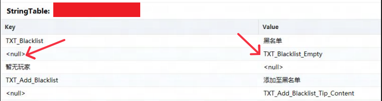
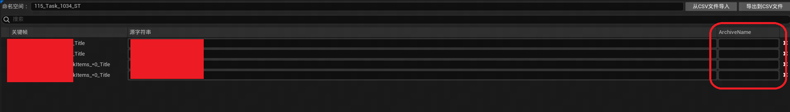
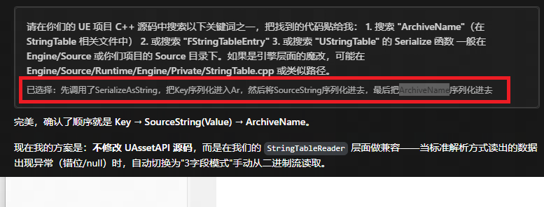

# 项目适配
## 出现的问题
用工具打开后，发现StringTable有很多的null，并且显示错位

打开编辑器看了下项目内的StringTable，发现多了一个ArchiveName

## 寻求解决方案
在FDataTableCore中发现多了一个ArchiveName字段，并且在FDataTable的序列化方法中发现序列化的顺序为先存入Key，然后写入SourceString，最后写入ArchiveName，告知AI后，AI修了了UAssetAPI的代码，进行多轮调试，最终实现了功能。

