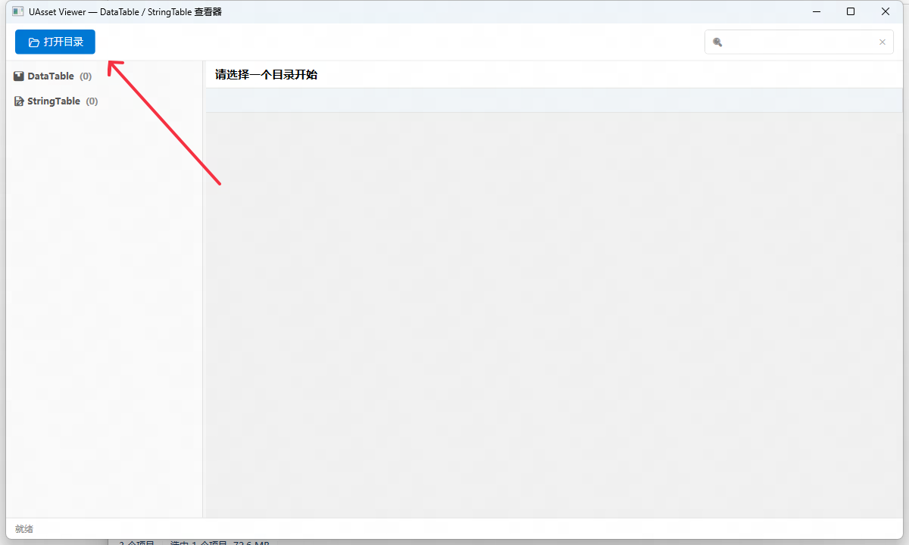
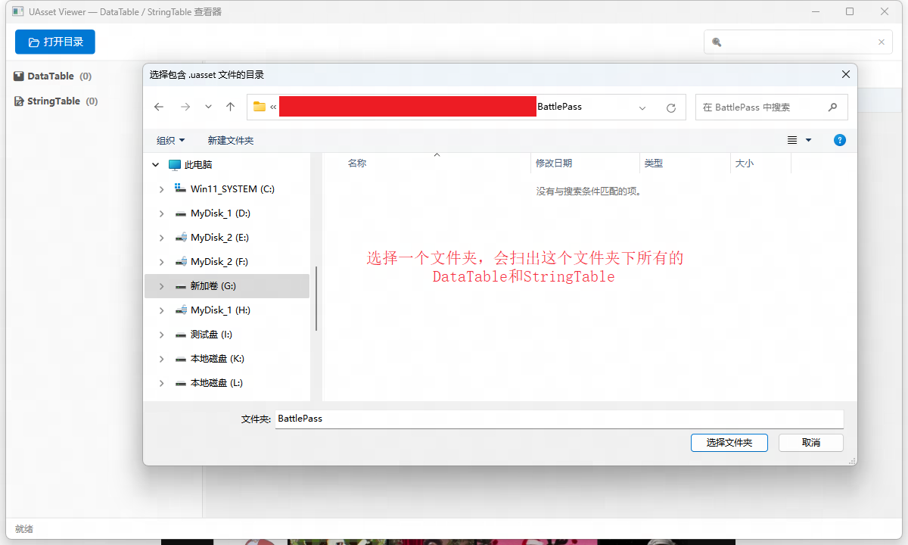
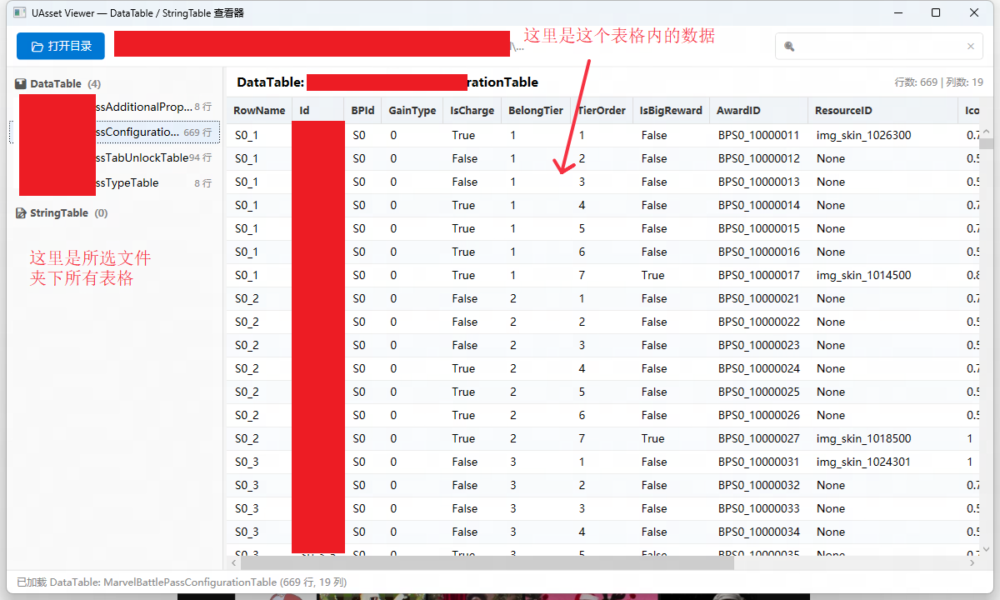

# UAsset查看器

## 背景介绍
UE的所有表格操作都需要在编辑器中进行，编辑器的启动过程算不上快，而且当有同学的提交导致编辑器无法启动时，查看数据就让人很难受。于是有了能否开发工具来进行离线操作的想法

## 功能介绍
基于开源的UAssetAPI工程，来直接读取.uasset文件的数据，因为这种方法比较暴力，只实现了读的功能，并适配了我们项目对StringTable的魔改。为了减小复杂度，暂时只支持比较简单的DataTable和StringTable数据的读取。

完整的代码在Source文件夹下，可执行程序为UAssetViewer.exe

## 使用方法






## 开发流程
### 分析需求
先简述需求，然后让AI详细分析一下，提示词如下：

```
我希望做一个可视化的工具，在不打开UE编辑器的情况下，能查看DataTable和StringTable中的数据。
大致的工作流是给这个工具指定一个目录，然后工具读取所有能解析的DataTable和StringTable呈现给用户，用户选择某一个打开查看

这些asset保存于UE引擎的5.3.2版本，但是整个项目组有魔改过引擎的源码，不确定是否改到了相关序列化的逻辑。
我预期是借助UAssetAPI来进行实现。现在你站在TD的角度上仔细分析一下这个需求，看是否可行，如果可行，给出更细节的需求文档
```

后续经过多轮对话，把整个工具的开发分成了两个部分，可行性验证和功能开发

### 可行性验证
[AI可行性验证设计](Docs/2.可行性验证.md)

### 功能开发
[AI功能开发](Docs/3.基于WPF的UI界面开发.md)

### 兼容项目改动
[兼容项目定制的序列化](Docs/4.项目定制的StringTable适配.md)